# Desafio DIO - Criação de Cenários Controlados para Simulação de Vulnerabilidades

## Objetivo
Este projeto documenta a criação de um ambiente controlado para estudo de vulnerabilidades em aplicações.  
## Tecnologias Utilizadas

- [VirtualBox](https://www.virtualbox.org/)  
- [Kali Linux](https://www.kali.org/)  
- [Docker](https://www.docker.com/)  
- [DVWA - Damn Vulnerable Web Application](http://www.dvwa.co.uk/)  
- [Nmap](https://nmap.org/)  
- [SQLMap](http://sqlmap.org/)  
- [UFW - Uncomplicated Firewall](https://wiki.ubuntu.com/UncomplicatedFirewall)  

---

## Prints do Ambiente

Abaixo estão alguns prints que comprovam a configuração do ambiente e execução dos testes.

### docker_version_26_1
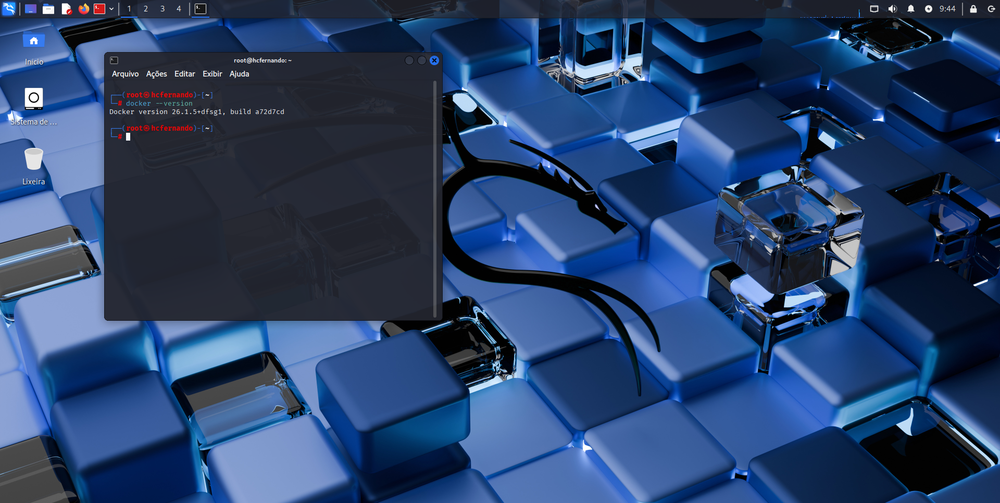

### DVWA
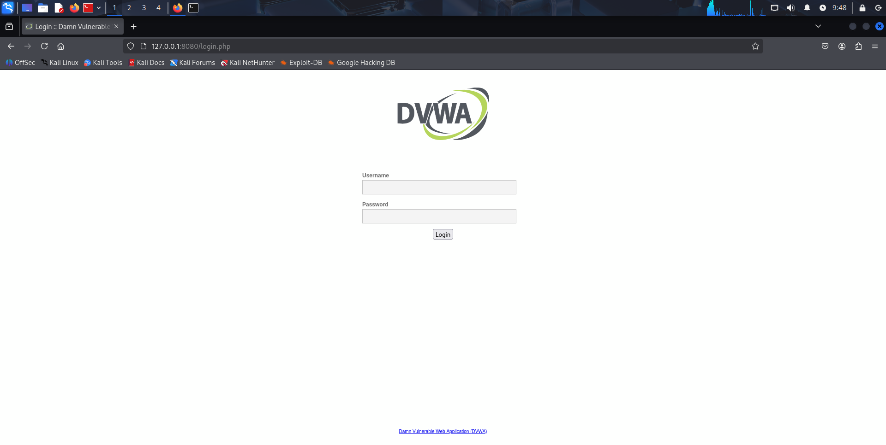

### kali-desktop
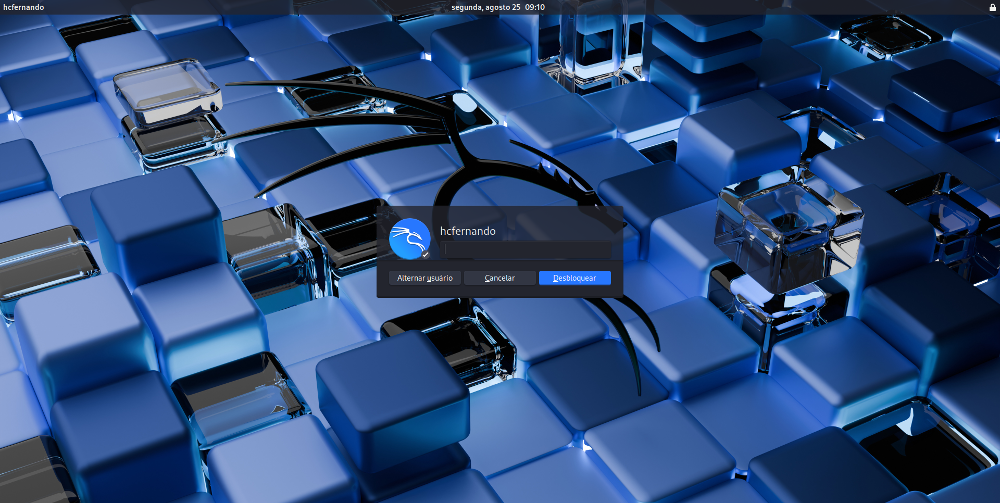

### nmap

### sqlmap
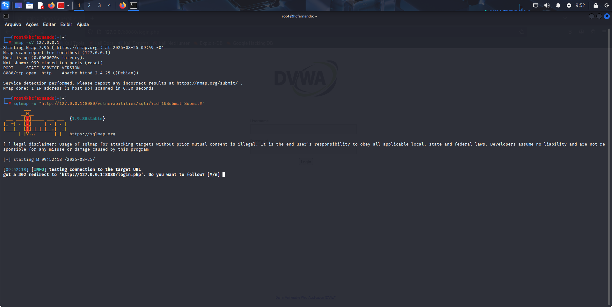

### sqlmap2
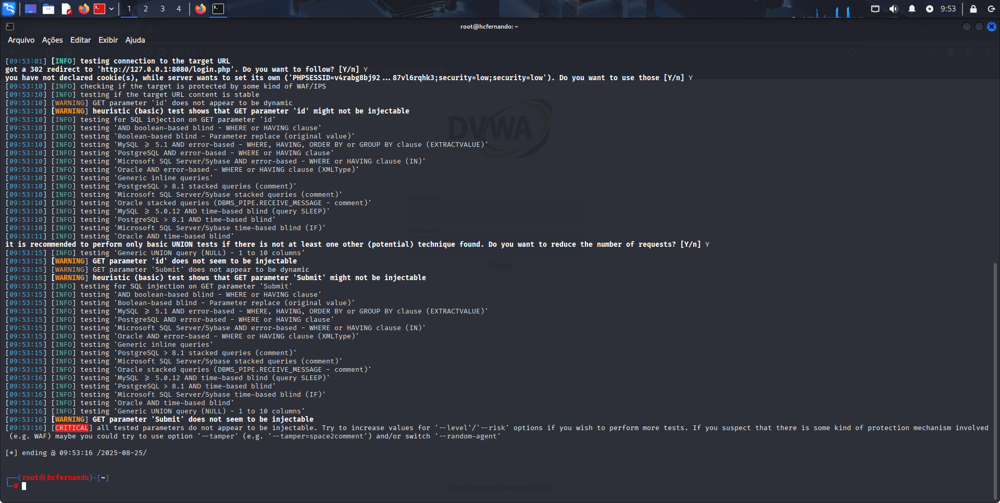

### ufw
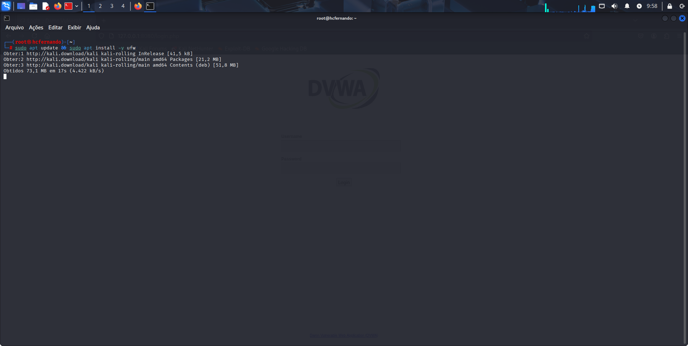

### ufw2
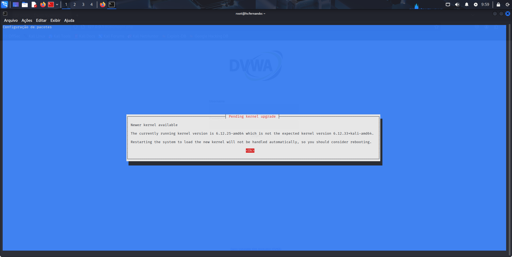

### ufw3
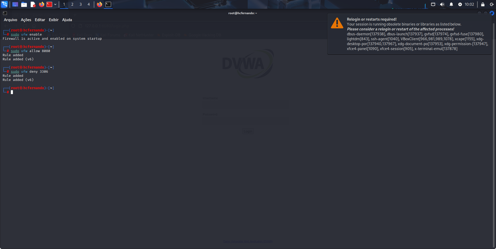

### ufw_version_0_36_2
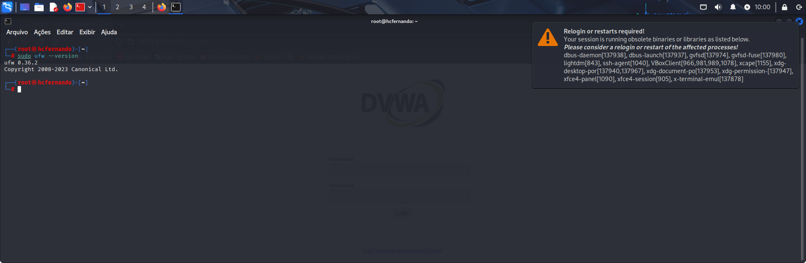

### VirtualBox_kali linux_25_08_2025_09_18_55

### VirtualBox_kali linux_25_08_2025_09_19_56
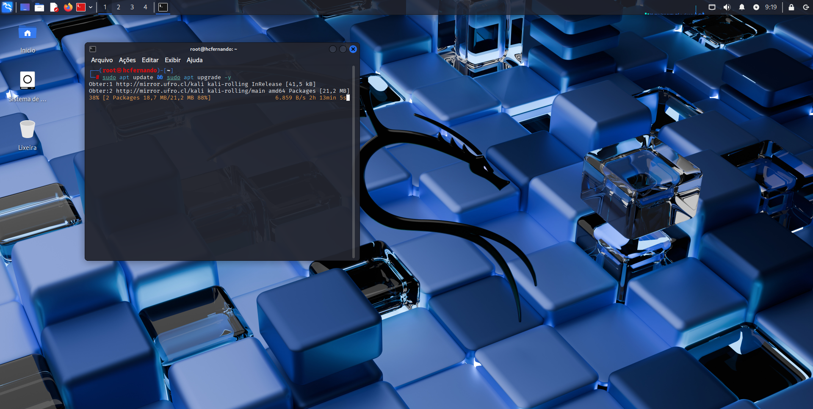

### VirtualBox_kali linux_25_08_2025_09_34_47
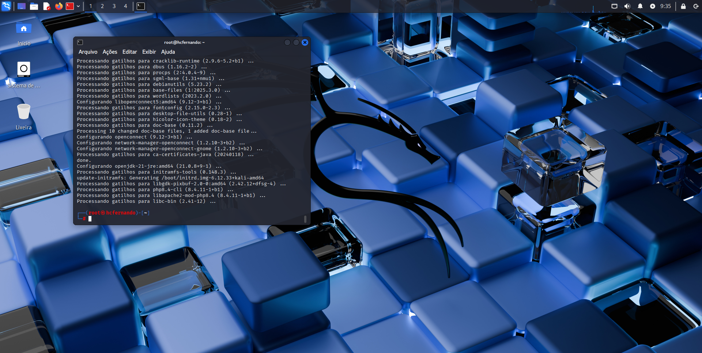

### VirtualBox_kali linux_25_08_2025_09_40_15
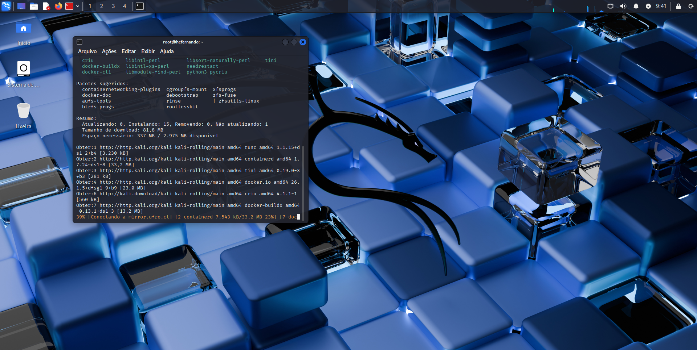

### VirtualBox_kali linux_25_08_2025_09_42_03
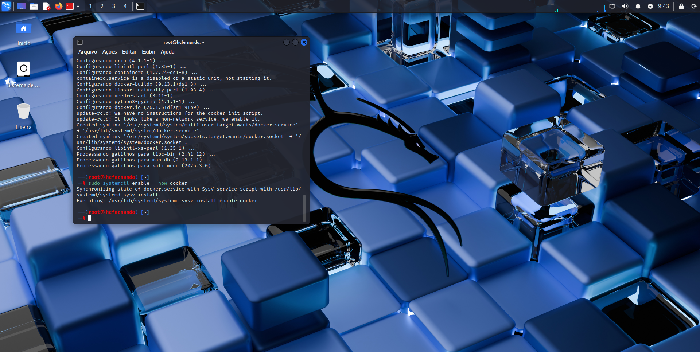

### VirtualBox_kali linux_25_08_2025_09_46_05
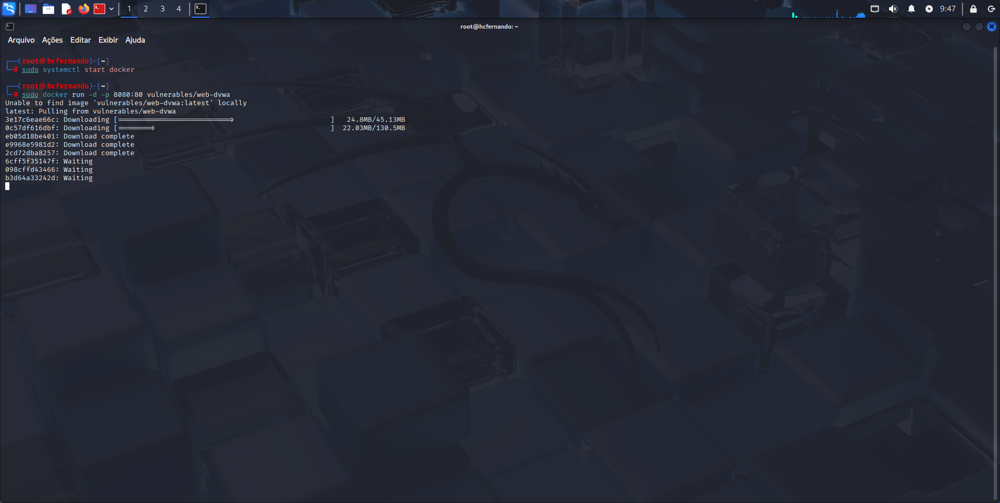

### VirtualBox_kali linux_25_08_2025_10_03_15
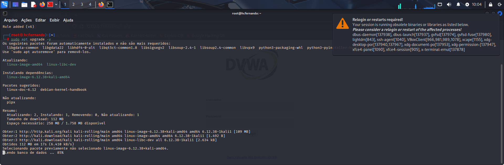

### VirtualBox_kali linux_25_08_2025_10_03_52
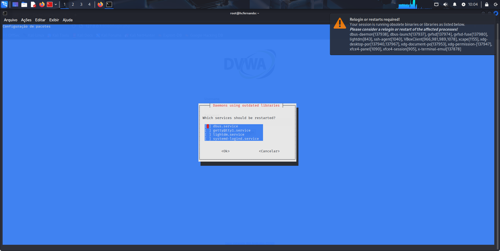

### VirtualBox_kali linux_25_08_2025_10_04_18

---

## Conclusão

Foi possível criar um **ambiente seguro e controlado** para realizar **testes de vulnerabilidades** em aplicações.  
Com o uso do **Kali Linux, DVWA e ferramentas de análise (Nmap, SQLMap, UFW)**, aprendi a importância de **testes práticos de segurança**.  
